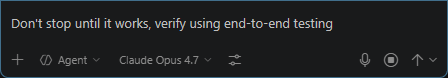
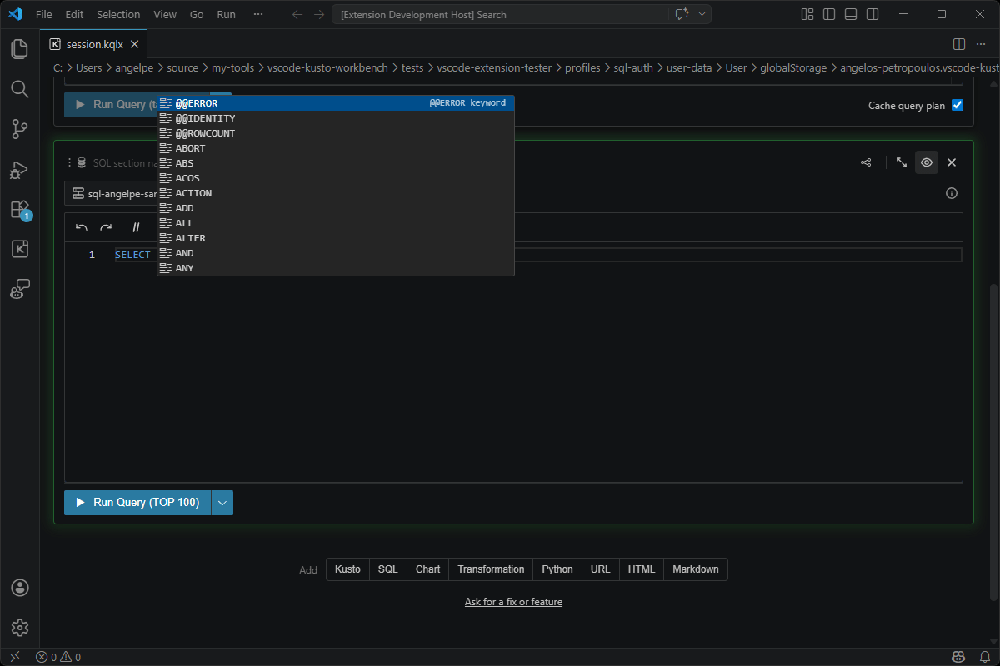

# vscode-ext-test

End-to-end tests for VS Code extensions as if a real user was operating them, optimized for being driven by an autonomous AI agent during development time to complete features with confidence.

Write tests (or better yet, let the agent write the tests) in plain English using [Gherkin](https://cucumber.io/docs/gherkin/) `.feature` files. The framework interprets the steps, drives VS Code through a WebSocket-controlled extension, and reports results.

Here is an example of me asking Copilot to test the auto-completion of SQL statements in my VS Code extension:





## Quick Start

Just init the extension project you want to enable this for, and a SKILLS.md file (and other artifacts) will be added and you are good to go.

```bash
# Install globally
npm link  # from packages/cli/

# Set it up to work in a project
cd your-extension/
vscode-ext-test init                     # scaffolds configs + installs controller
```

Rerun `vscode-ext-test init` after upgrading the CLI to refresh the generated
`.github/skills/e2e-test-extension/SKILL.md` instructions. Project-specific
notes in `repo-knowledge.md` are preserved.

## Writing Tests Manually

Tests use standard Gherkin syntax:

```gherkin
Feature: My Extension Basics

  Scenario: Open the welcome view
    Given VS Code is running with my-extension activated
    When I run the command "myExtension.openWelcome"
    Then a webview panel titled "Welcome" should be visible
```

See [features/README.md](features/README.md) for conventions and the [features/examples/](features/examples/) directory for more examples. Just have Copilot write the tests for you.

## Running Tests

### Basic run (no special arguments)

```bash
vscode-ext-test run
```

This launches a fresh, isolated VS Code instance with your extension loaded, executes every `.feature` file found under the features directory, and reports results to the console. Because no profile is specified, VS Code starts with a clean, ephemeral user-data directory -- no saved settings, no logged-in accounts, and no extra extensions beyond the controller and your extension under test. Use this mode for tests that don't need any pre-existing state (e.g. verifying commands, UI elements, or default behavior).

### Run with a named profile

```bash
vscode-ext-test run --reuse-named-profile sql-authenticated
```

This reuses a previously prepared named profile (`sql-authenticated` in this example). Named profiles live under `tests/vscode-extension-tester/profiles/<name>/` and carry their own `user-data` and `extensions` directories, which means they preserve login sessions, settings, and installed extensions across runs.

You want this whenever your tests depend on state that can't be set up automatically like for example, an OAuth sign-in to a third-party service, a database connection that requires interactive credentials, or specific VS Code settings that must be configured through the UI. Create a profile once with `vscode-ext-test profile open sql-authenticated`, set it up interactively, and then every subsequent `--reuse-named-profile sql-authenticated` run inherits that state without repeating the manual setup.

## Build

```bash
# Build everything
npx turbo build

# Build + package the controller extension
npx turbo build --force
cd packages/controller-extension
npm run package
```

## Releasing

Release artifacts are built by GitHub Actions on Windows so the packaged CLI includes both required runtime assets:

* `assets/controller-extension.vsix` \- bundled controller extension installed by `vscode-ext-test install`
* `assets/native/win-x64/FlaUIBridge.exe` \- self\-contained native UI automation bridge for Windows CI agents

To create a CLI release, bump the CLI package version, then push the matching
semver tag. The bundled controller extension VSIX has its own independent
version and does not need to match the CLI version:

```bash
git tag v<version>
git push origin v<version>
```

The `Release` workflow runs tests, builds the TypeScript packages, packages the controller extension, publishes the native bridge, runs `npm pack`, and uploads the installable tarball to the GitHub Release. Manual workflow runs are also supported; they upload the same files as workflow artifacts without creating a GitHub Release.

Downstream CI can install the released CLI directly from the tarball:

```bash
npm install -g https://github.com/<org>/vscode-extension-tester/releases/download/v<version>/vscode-ext-test-<version>.tgz
vscode-ext-test install
vscode-ext-test run --features tests/vscode-extension-tester/e2e
```

### Versioning Builds

Use the versioning helper whenever the bundled controller extension VSIX changes.
This bumps only `packages/controller-extension/package.json` and matching lockfile
metadata; the CLI package version is independent and may differ:

```bash
npm run version:extension -- patch --note "Controller install resolver fix"
```

The first positional argument can be `patch`, `minor`, `major`, or an explicit
version such as `4.1.2`. Use `--dry-run` to preview the next VSIX version without
writing files. Controller extension version history is tracked in
`extension-version-history.json` and `CHANGELOG.md`.

## Commands

| Command | Description |
| ------- | ----------- |
| `init` | Install controller extension, scaffold `.feature` file, `launch.json`, and `tasks.json` |
| `run` | Execute `.feature` tests (dev mode or CI mode) |
| `live` | Start or attach to VS Code once and execute Gherkin steps over JSONL stdin/stdout |
| `tests add [context...]` | AI agent analyzes codebase, writes tests, explores the live extension, self-heals failures |
| `install` | Install the controller extension + check prerequisites (`gh`, `git`, VS Code CLI auto-discovery) |
| `uninstall` | Remove the controller extension |

### `run` Options

| Flag | Default | Description |
| ---- | ------- | ----------- |
| `--attach-devhost` | `false` | Attach to an already-running Dev Host |
| `--extension-path <dir>` | `.` | Path to the extension project |
| `--features <dir>` | `tests/vscode-extension-tester/e2e` | Root directory for `.feature` files |
| `--test-id <slug>` | - | Select features from `e2e/<profile>/<slug>/` |
| `--vscode-version <ver>` | `stable` | VS Code version for isolated launch |
| `--record` | `false` | Enable screen recording |
| `--record-on-failure` | `false` | Record only when tests fail |
| `--reporter <type>` | `console` | Output format: `console`, `json`, `html` |
| `--controller-port <n>` | `9788` | Controller WebSocket port |
| `--cdp-port <n>` | `9222` | Chrome DevTools Protocol port |
| `--timeout <ms>` | `30000` | Per-step timeout |
| `--no-build` | - | Skip building the extension before running |
| `--paused` | `false` | Set up the environment but pause before running tests |
| `--parallel` | `false` | Run reset-boundary groups in parallel |

### Live Gherkin stepping

Use `live` when an agent or script needs to keep VS Code open while trying Gherkin steps one at a time:

```bash
vscode-ext-test live --mode auto
```

The command emits JSONL on stdout and reads JSONL requests from stdin. All operational logs are routed to stderr so stdout stays machine-readable.

```jsonl
{"id":1,"method":"runStep","params":{"step":"When I execute command \"workbench.action.showCommands\""}}
{"id":2,"method":"runScript","params":{"script":"Then I wait 1 second\nWhen I press \"Escape\""}}
{"id":3,"method":"runExtensionHostScript","params":{"script":"return vscode.window.activeTextEditor?.document.uri.toString();","timeoutMs":5000}}
{"id":4,"method":"end"}
```

Live mode supports `auto`, `launch`, and `attach`. Launch/auto mode also accepts `--reuse-named-profile`, `--reuse-or-create-named-profile`, and `--clone-named-profile`; auto attach only reuses an existing Dev Host when its detected user-data directory matches the requested profile. Each step returns pass/fail status, output/log artifact paths, current VS Code state, and screenshots according to `--screenshot-policy` (`always`, `onFailure`, or `never`). Screenshot capture warnings are included in the step artifacts and reports. A final screenshot is captured before shutdown unless `--no-final-screenshot` is set. In attach mode, ending a session only disconnects from the existing Dev Host.

Use `runScript` for Gherkin step blocks. Use `runExtensionHostScript` only for explicit diagnostic JavaScript that must run inside the VS Code extension host with the `vscode` API available.

`tests add` uses live probing by default when exploration is enabled. Control it with `--live-mode auto|launch|attach|off`.

### Pausing before test execution

Use `--paused` to have the framework set up the full environment (build, launch VS Code, connect to the controller) but stop before running any tests:

```bash
vscode-ext-test run --paused --test-id sql-inline-completions --reuse-named-profile sql-auth
```

The CLI will print `Press Enter to run tests, or Ctrl+C to exit...` once everything is ready. This gives you a chance to:

* Visually inspect the VS Code instance to confirm the extension loaded correctly
* Check that authentication sessions or connections are in place
* Open Developer Tools or the Output panel to watch logs live
* Interact with the UI manually before the automated steps begin

Press **Enter** to proceed with test execution, or **Ctrl+C** to tear down without running anything.

## Capturing Output Channels

The framework automatically intercepts all VS Code output channels (including those created by other extensions) so you can assert on their content in tests. By default, **every channel is captured** — no setup required for simple assertions:

```gherkin
Scenario: Extension logs startup message
  When I execute command "myExtension.activate"
  Then the output channel "My Extension" should contain "Initialized"
```

### Allow-list mode

If you only care about specific channels, use the `I capture the output channel` step. This switches to **allow-list mode** — only explicitly declared channels are included when querying captured output:

```gherkin
Scenario: Monitor only the channels I care about
  Given I capture the output channel "My Extension"
  When I execute command "myExtension.doWork"
  Then the output channel "My Extension" should contain "Work complete"
  And I stop capturing the output channel "My Extension"
```

### Available steps

| Step | Type | Description |
| ---- | ---- | ----------- |
| `I capture the output channel "<name>"` | Given/When | Start capturing a specific channel (switches to allow-list mode) |
| `I stop capturing the output channel "<name>"` | When | Stop capturing a specific channel |
| `I wait for QuickInput item "<label>"` | Then | Wait for a QuickInput item from the captured model or visible workbench widget |
| `I select QuickInput item "<label>"` | When | Select a QuickInput item by visible label or item id |
| `I enter "<text>" in the QuickInput` | When | Enter and accept QuickInput text after validation clears |
| `I click the webview element "<text>"` | When | Click a webview control by visible text, aria-label, title, or role text |
| `I evaluate "<js>" in the webview for <N> seconds` | When | Run diagnostic JavaScript in a webview with an explicit timeout budget |
| `I click "<action>" on notification "<text>"` | When | Resolve a captured VS Code notification action |
| `I wait for progress "<title>" to complete` | Then | Wait for a tracked VS Code progress operation to finish |
| `the output channel "<name>" should contain "<text>"` | Then | Assert the channel contains the given text |
| `the output channel "<name>" should not contain "<text>"` | Then | Assert the channel does NOT contain the given text |
| `the output channel "<name>" should have been captured` | Then | Assert that any content was captured for the channel |

### How it works

The controller extension patches `vscode.window.createOutputChannel` at two levels:

1. **Prototype-level** — intercepts writes on channels created *before* the controller activated (solves activation-order races)
2. **Instance-level** — wraps channels created *after* the controller, including `LogOutputChannel` methods (`trace`, `debug`, `info`, `warn`, `error`)

This means you can assert on output from any extension, regardless of activation order.

## Architecture

See [ARCHITECTURE.md](ARCHITECTURE.md) for a detailed breakdown.

## Contributing

See [CONTRIBUTING.md](CONTRIBUTING.md) for development setup, build instructions, and guidelines.

## Prerequisites

> **Note:** This project has only been tested on Windows. Parts of it may work on macOS/Linux but that is unverified.

* **Windows 10/11**
* **Node.js** \>= 20
* **npm** \>= 10
* **GitHub CLI** (`gh`) - for LLM authentication via GitHub Models
* **VS Code** \- for running and testing extensions
* **.NET 8** (optional) - only needed for the FlaUI native UI bridge (Windows-only)

## License

MIT